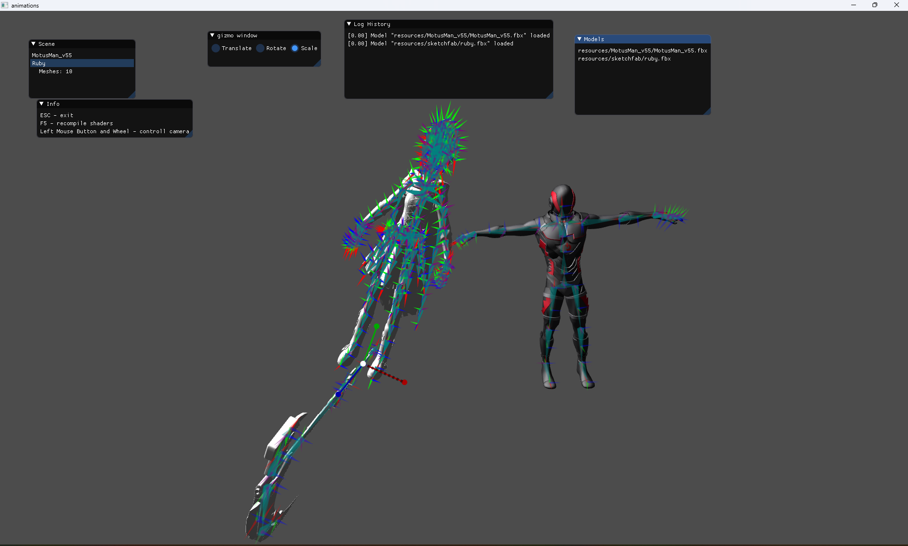
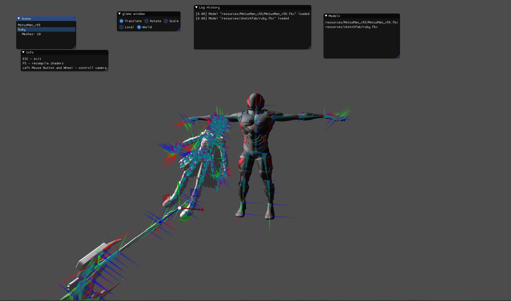

# Caution

I have deleted .vs folder from git (cause it weighed too much), so be sure to restore it if you are using Visual Studio!

# HW2

## What I did

- TODO

# HW1

## What I did

- load bones

- draw vectors for bones according to their orientation (rgb arrows, length ~ weight)

- draw connections from nodes to their children nodes (cyan arrows)

